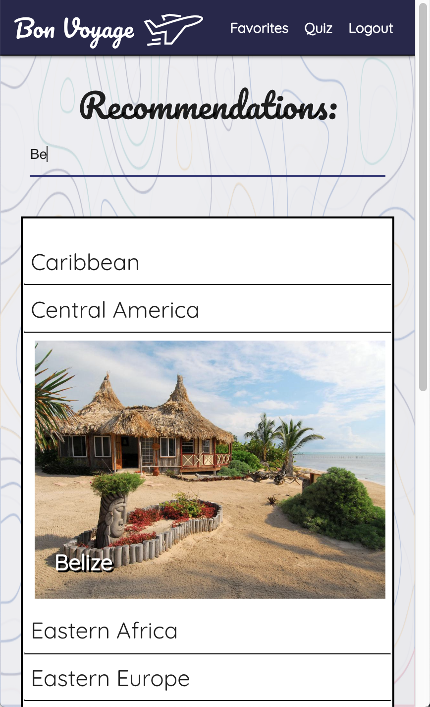
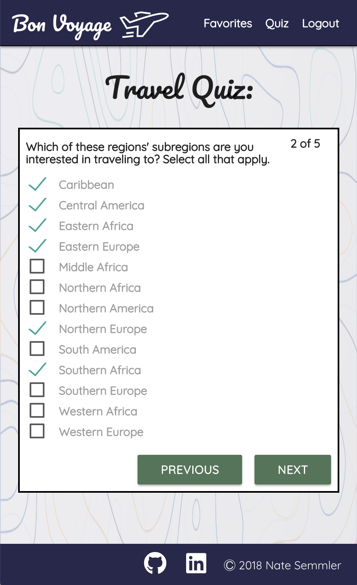
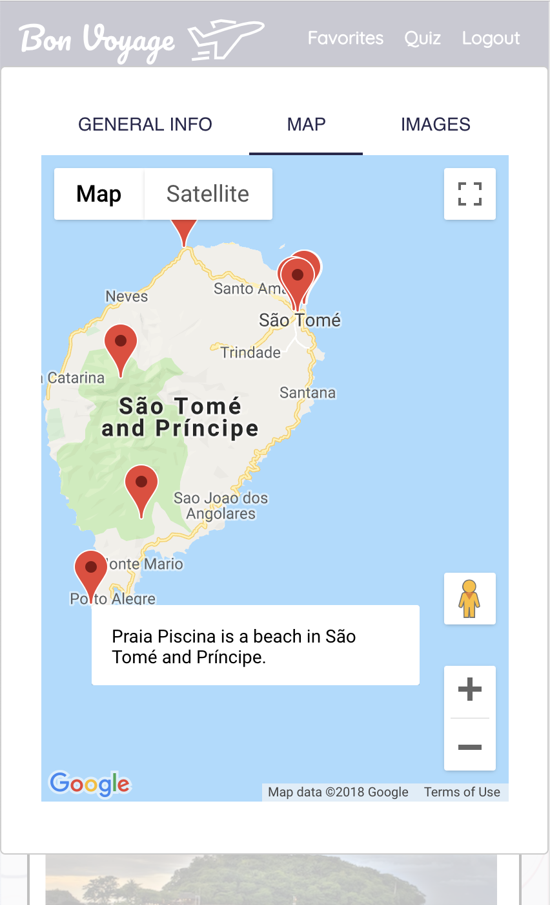

# [Bon Voyage](https://voyage-capstone.herokuapp.com)


<p float="left">
  
  
  
</p>

### About
Most travel sites provide users with the tools to help them plan and book their next
vacation.  This requires the user to have already chosen their vacation destination
in advance, which is a difficult decision to make.  Bon Voyage is aimed at helping
users determine *where* in the world to travel.

When a user logs in for the first time they are re-directed to a short quiz.  The
quiz is intended to help the user filter out countries that don't meet their criteria
for a good vacation.  Once the user has taken the quiz they can browse through the
recommended vacation destinations and choose favorites that they can save for later.

### Technologies Used
- React
- Redux
- React Materialize
- HTML
- CSS
- Axios
- Google Maps


### Get Started Locally
```bash
git clone https://github.com/nsemmler/bon-voyage.git
cd bon-voyage
npm install
npm start
```
